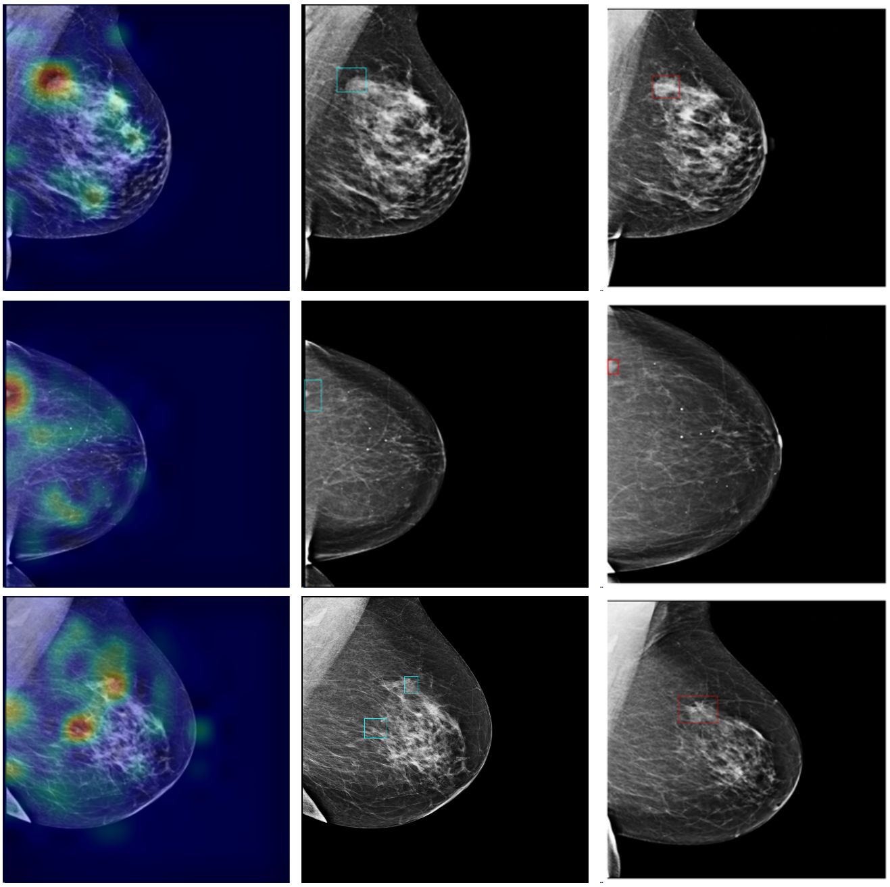
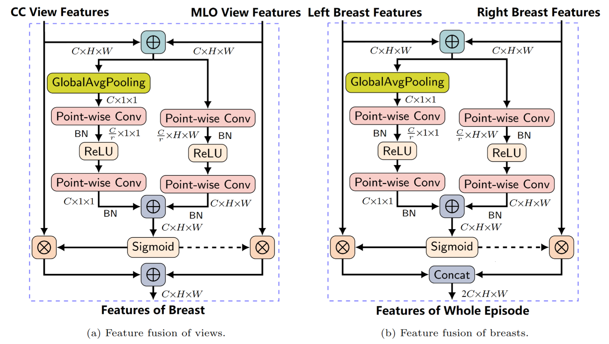

# BREST (Breast cancer Risk Evaluation model from Screening Tests)
This application is intended for research purposes only. It is not a substitute for professional medical advice, diagnosis, or treatment. Always seek the guidance of a qualified healthcare provider with any questions you may have regarding medical decisions.
## Introduction
Breast cancer is one of the most common cancers in women globally. Early detection and accurate risk prediction can significantly improve patient outcomes. This project utilises advanced deep learning techniques to estimate the risk of breast cancer from mammograms with a negative screening outcome.
We trained BREST in three incremental phases, each increasing the task complexity:

Phase 1: We fine-tuned a pre-trained ResNeXt-50, using image patches from annotated regions of interest (ROIs). Cropping mammograms around lesion bounding boxes focuses the model on clear examples of abnormality, establishing a strong initial representation for cancer detection.

Phase 2: We added two more ResNeXt layers and trained on full mammogram images for CAD. We then fine-tuned this CAD model on risk data (MP, CIP) to produce a dedicated risk-prediction model. Transitioning from local ROIs to whole images teaches the model to contextualise smaller lesions within the broader mammographic field.

Phase 3: We introduced one additional ResNeXt layer and integrated AFF. This final architecture, trained on multi-view screening episodes, leverages fused features to capture bilateral and multi-view information. Depending on the dataset (CAD or risk), this final model can predict either disease presence or future cancer risk.

Two BREST variants (BREST-CAD and BREST-risk) were trained respectively for (computer-aided) detection (CAD) and cancer risk prediction, using the same architectural backbone.

## Project Structure
```text
.
├── data/
│   ├── test_metadata_example.csv
│   ├── dicom-to-processed-PNG.py
│   ├── sort_csv.py
├── models/
│   ├── Please get in touch for pre-trained models.
├── scripts/
│   ├── episodeLevel-inference.py
│   ├── imageLevel-inference.py
│   ├── models.py
├── requirements.txt
├── README.md
```
## Features
### Data Pre-processing
Convert DICM to PND

Rank metadata CSV according to a custom ranking of the 'ViewPosition' and 'ImageLaterality' fields, grouped by 'ClientID' and 'EpisodeID'.

### Inference
Image-Level Inference

Episode-Level Inference

## Requirements & Installation
Check the requirements.txt

Create and activate a virtual environment (conda or venv example):

  conda create --name breast-cancer-risk python=3.8  
  conda activate breast-cancer-risk

Install dependencies:

  pip install -r requirements.txt

## Data
## Training & Evaluation
## Results
### ROC-AUC and PPV vs. Recall

### RiskModel Score-CAM

## Model Architecture
### Model Architecture

### AFF Multi-View Feature Fusion

### Model Details


