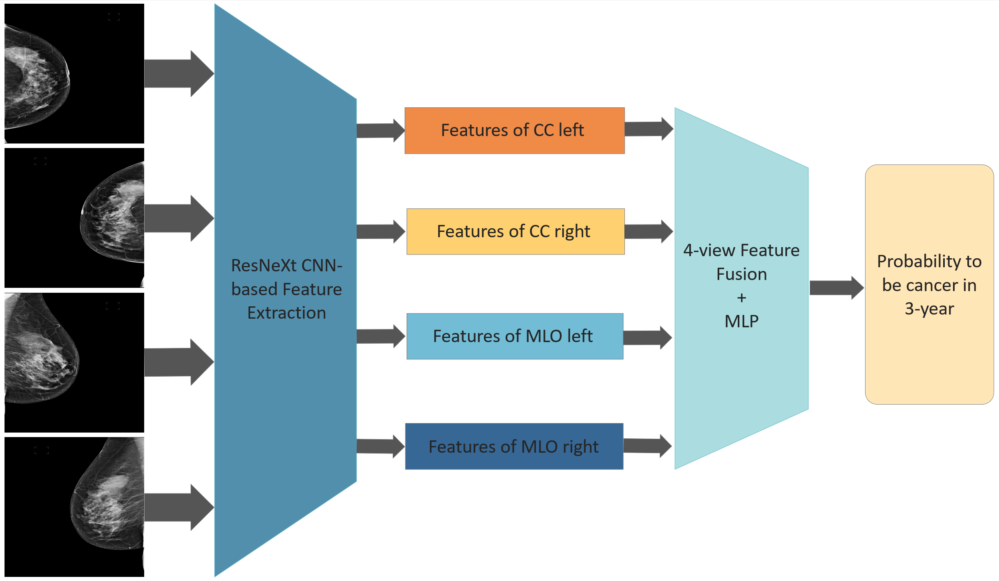

# BREST (Breast cancer Risk Evaluation model from Screening Tests)
This application is intended for research purposes only. It is not a substitute for professional medical advice, diagnosis, or treatment. Always seek the guidance of a qualified healthcare provider with any questions you may have regarding medical decisions.

## Introduction
Breast cancer is one of the most common cancers in women globally. Early detection and accurate risk prediction can significantly improve patient outcomes. This project utilises advanced deep learning techniques to estimate the risk of breast cancer from mammograms with a negative screening outcome.

## Project Structure
```text
.
├── data example/
│   ├── raw/
│   ├── processed/
├── models/
│   ├── Please get in touch for pre-trained models.
├── scripts/
│   ├── train.py
│   ├── evaluate.py
├── notebooks/
│   ├── exploratory_data_analysis.ipynb
├── environment.yml
├── requirements.txt
├── README.md
```
## Features
## Requirements & Installation
Check the environment.yml and requirements.txt
## Data
## Training & Evaluation
## Results
## Model Architecture


