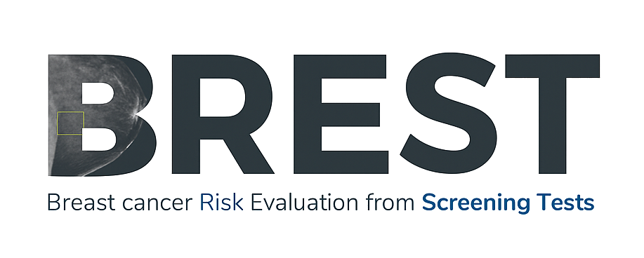
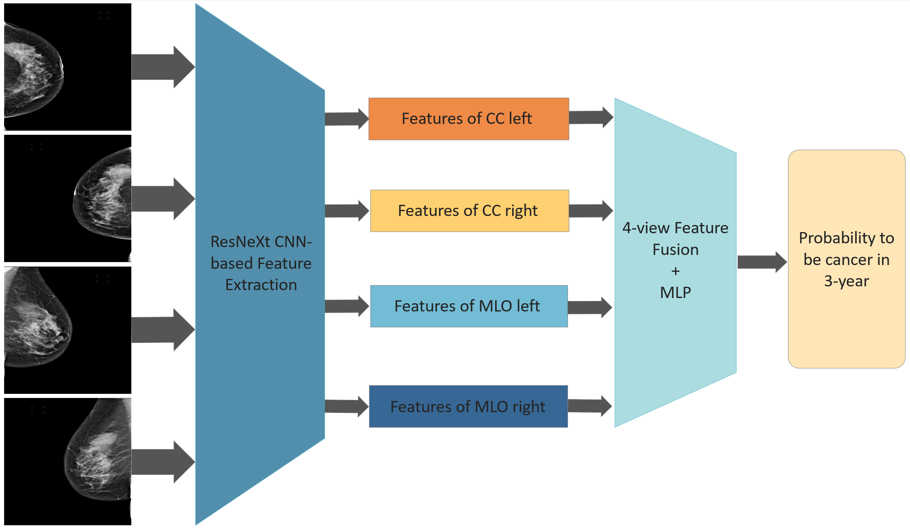
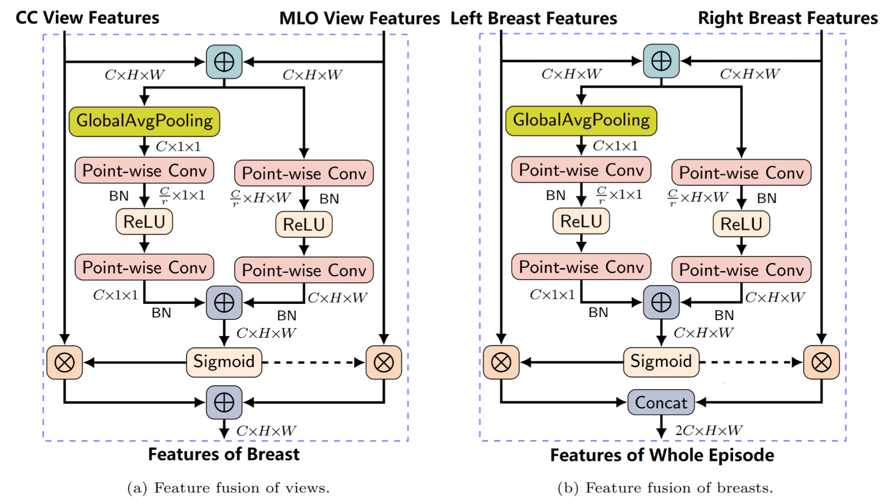
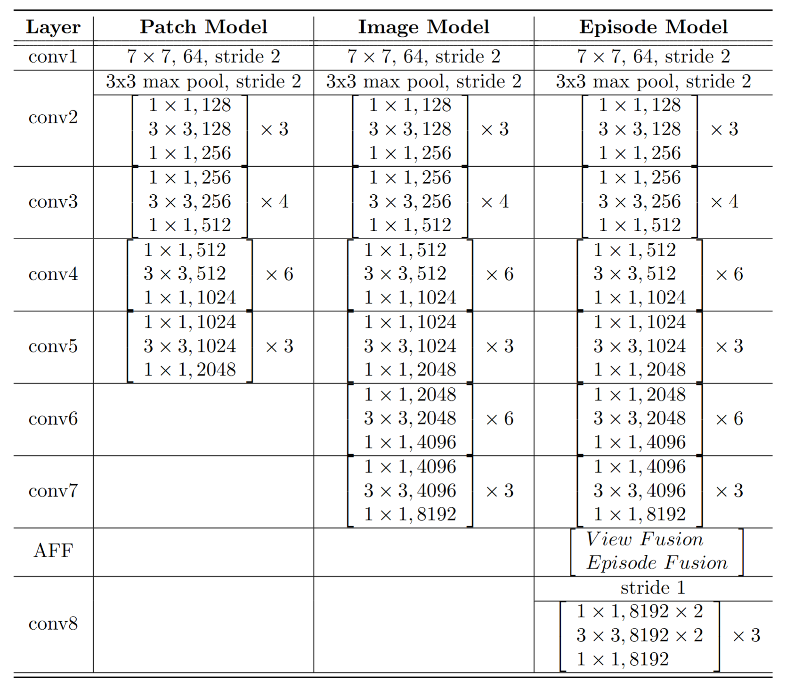
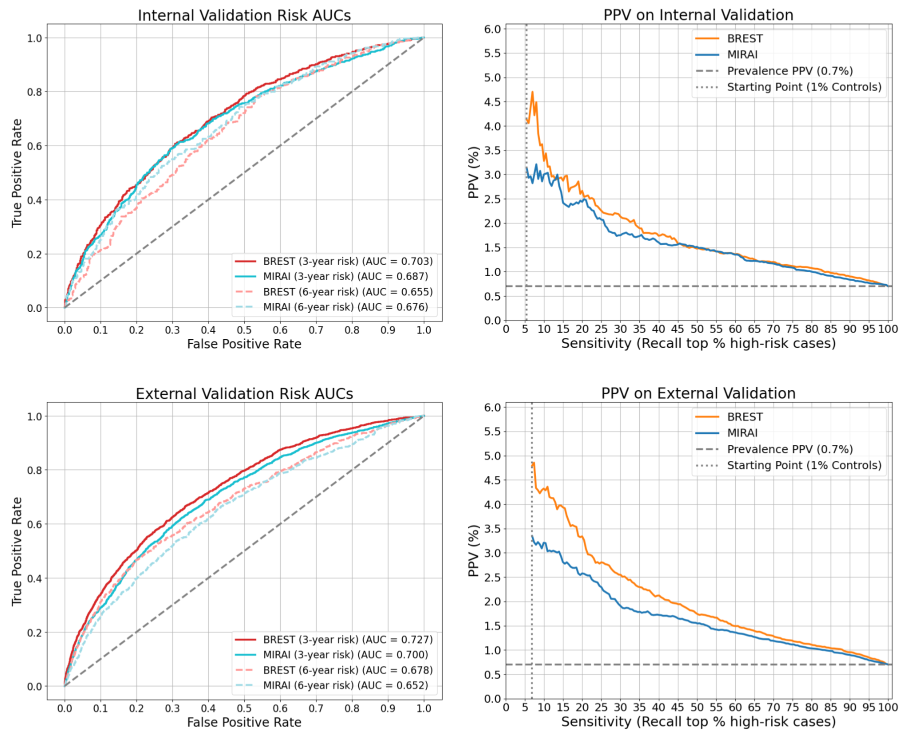
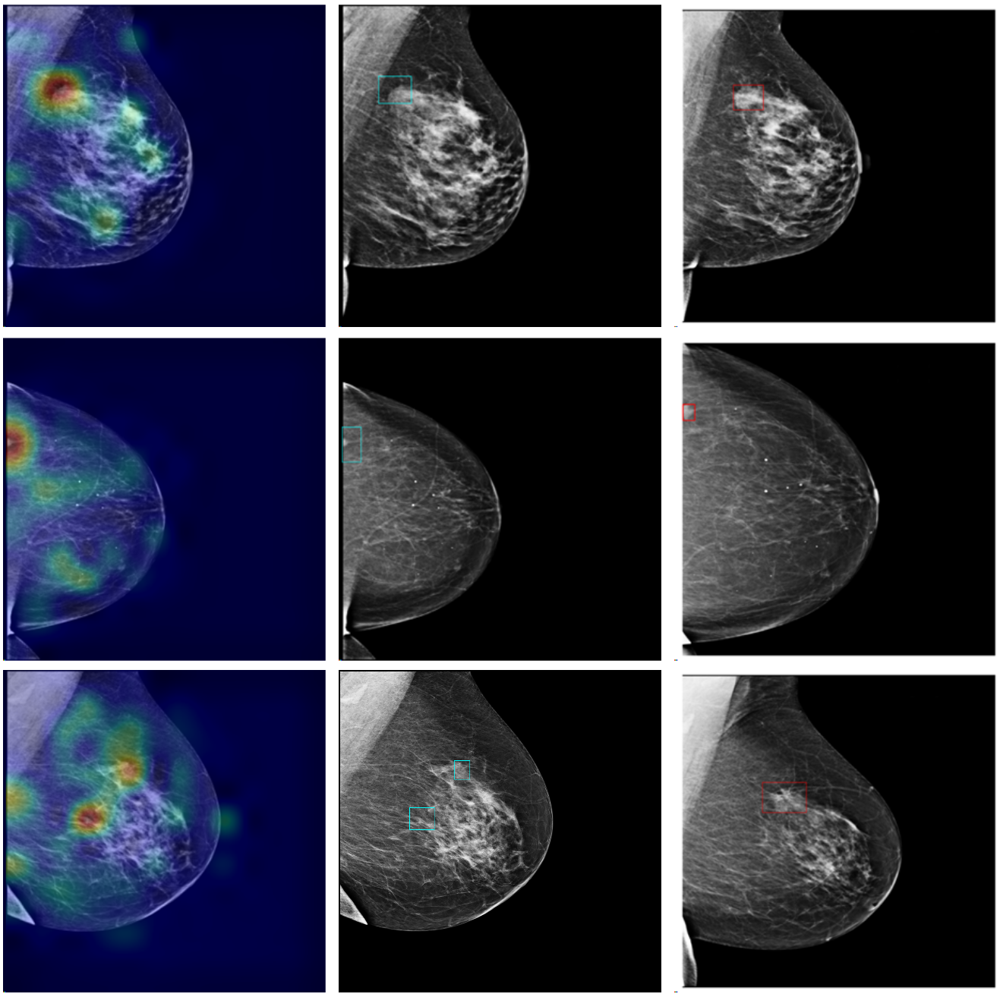

<p align="center">
  <picture>
    <source media="(prefers-color-scheme: dark)" srcset="assets/logo-light.png">
    <source media="(prefers-color-scheme: light)" srcset="assets/logo-dark.png">
    
  </picture>
</p>

<p align="center">
  A deep learning model for 3-year breast cancer risk prediction from screening mammograms.
</p>

---

BREST is a deep learning system that assesses 3-year breast cancer risk using screening mammograms, developed at the University of Warwick and trained exclusively on data from the English NHS Breast Screening Programme (OPTIMAM database).

The approach follows a "better CAD, better risk" hypothesis: a more accurate cancer detection model can be adapted into a more effective risk prediction model. BREST was first trained for cancer detection and then fine-tuned for 3-year risk assessment.

> **This is intended for research purposes only. Not a substitute for professional medical advice.**

## Model Architecture

BREST uses a **ResNeXt-50** backbone with **Attentional Feature Fusion (AFF)** to integrate multi-view mammographic data (CC and MLO views from both breasts).

<p align="center">
  
</p>

### Curriculum Learning

Training uses a three-phase strategy with increasing complexity:

1. **Patch-level** — Fine-tune on expert-annotated lesion regions
2. **Full-image CAD** — Train on full mammograms for cancer detection
3. **Multi-view risk prediction** — Integrate feature fusion, fine-tune for 3-year risk

Two final models are available: **BREST-CAD** (cancer detection) and **BREST-Risk** (risk prediction).

<details>
<summary>Feature fusion and model details</summary>

<p align="center">
  
</p>

<p align="center">
  
</p>

</details>

## Performance

Evaluated on case-control studies from five NHS screening sites. External validation: **7,596 women** (1,899 cancer cases).

| Model | AUC | p-value |
|-------|-----|---------|
| **BREST** | **0.727** | — |
| Mirai | 0.700 | < 0.001 |

The top 1% identified as high-risk had a PPV of **5.3%** (relative risk 6.6 vs. average).

<p align="center">
  
</p>

### Subgroup Analysis

- Strong performance across cancer sizes, grades, and ER-status
- Highest for large, ER-positive, and grade 1–2 cancers
- Ablation study confirms value of each training phase

## Explainability

Score-CAM saliency maps highlight high-risk regions. In 11 of 30 reviewed cases (37%), the hotspots on prior mammograms were concordant with eventual malignancy location.

<p align="center">
  
</p>

## Getting Started

### Requirements

```bash
conda create --name brest python=3.8
conda activate brest
pip install -r requirements.txt
```

### Docker

A Docker container with all dependencies and trained weights is available (contact us for access):

```bash
docker load -i brest-16bit_3y-risk.tar
docker run -it --shm-size 16G --gpus all -v .:/data:z brest-16bit_3y-risk /bin/zsh
```

### Preprocessing

```bash
cd data
python dicom_to_png16_2048_background-cleaned.py \
    --csv-file-path /path/to/meta.csv \
    --dicom-dir /path/to/dicom_root \
    --processed-images-dir /path/to/output_png \
    --breast-mask-dir /path/to/output_masks \
    --max-workers 16
```

### Inference

```bash
cd scripts
python patientLevel-inference.py \
    --metadata_csv /data/metadata.csv \
    --image_root_dir /data/processedPNG \
    --final_csv_path /data/output/results.csv \
    --roc_plot_path /data/output/roc_curve.png \
    --model_checkpoint ../models/episode-Level-3yrisk.pth \
    --gpu_id 0
```

## Project Structure

```
├── data/                 Preprocessing scripts and example metadata
├── scripts/              Inference engines and model architecture
├── train/                Training utilities
├── models/               Pre-trained checkpoints (contact us)
├── Images/               Architectural diagrams
└── requirements.txt
```

## Team

University of Warwick, led by Professor Giovanni Montana:

- **Dr Jiefei Wei** — Postdoctoral Research Fellow
- **Xinyu Zhou** — PhD Student
- **Dr Adam Brentnall** — Senior Lecturer in Biostatistics
- **Dr Giovanni Montana** — Professor of Data Science

Funded by **Cancer Research UK (CRUK)** and the **Medical Research Council (MRC)**.

## Acknowledgements

Images and data derived from the OPTIMAM imaging database. We acknowledge the OPTIMAM project team and staff at the Royal Surrey NHS Foundation Trust, and Cancer Research UK who funded the database.

## License

See [LICENSE](LICENSE) for full terms.

## Contact

Giovanni Montana — [g.montana@warwick.ac.uk](mailto:g.montana@warwick.ac.uk)
