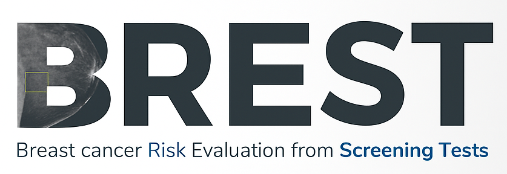
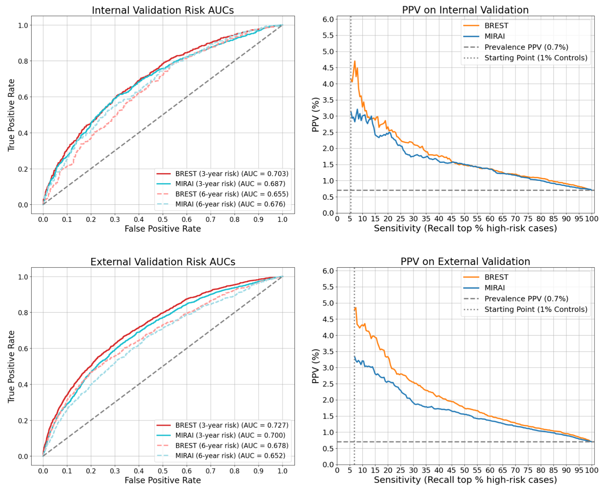

## Introduction
Breast cancer is one of the most common cancers in women globally, and early detection is key to improving patient outcomes. BREST (Breast cancer Risk Evaluation model from Screening Tests) is a deep learning model that assesses the 3-year risk of breast cancer using screening mammograms.

The development of BREST was guided by the "better CAD, better risk" hypothesis: a more accurate computer-aided diagnosis (CAD) model can be adapted to create a more effective risk prediction model. To achieve this, BREST was first trained as a cancer detection algorithm and then fine-tuned for 3-year risk assessment. The entire development and validation process exclusively used data from the English NHS Breast Screening Programme, sourced from the OPTIMAM Mammography Image Database (OMI-DB).

The purpose of this repository is to provide the source code for BREST, ensuring full transparency and enabling further research. The model's development and validation are detailed in our accompanying paper, the key results of which are summarised below.

## Model Architecture
BREST employs a ResNeXt-50 convolutional neural network (CNN) as its backbone to extract features from mammograms. To capture a comprehensive view of the screening episode, it integrates a multi-view feature fusion mechanism adapted from Attentional Feature Fusion (AFF). This approach first fuses the features from the CC and MLO views of each breast, and then merges the resulting breast-level representations to create a holistic view of the entire screening episode.

### Curriculum Learning
The model was trained using a three-phase curriculum learning strategy, which incrementally increases task complexity:
1.  **Patch-Level Training:** A pre-trained ResNeXt-50 is fine-tuned on image patches extracted from expert-annotated regions of interest (ROIs). This phase focuses the model on clear examples of abnormalities.
2.  **Full-Image CAD Training:** Additional layers are added to the network, and it is trained on full mammogram images for the cancer detection task. This teaches the model to contextualise lesions within the entire mammogram.
3.  **Multi-View Risk Prediction:** The feature fusion mechanism is integrated, and the model is fine-tuned on multi-view screening episodes to predict 3-year cancer risk.

Two final models are available: **BREST-CAD** for cancer detection and **BREST-Risk** for risk prediction.

### Architectural Diagrams
The following diagrams illustrate the different components of the BREST architecture.

**Model Overview:** This figure provides a high-level view of the entire BREST model, from input mammograms to the final risk score.


**Multi-View Feature Fusion:** This diagram details the Attentional Feature Fusion (AFF) mechanism, showing how information from the four mammographic views is combined.


**Model Details:** This figure presents a more granular look at the layers and connections within the ResNeXt backbone.


## Validation and Performance
The BREST model was rigorously evaluated using case-control studies from five screening sites within the English NHS programme. The data was divided into independent training, internal validation, and external validation sets. The external validation included **7,596 women** (1,899 cancer cases).

### Performance vs. Mirai
BREST's performance was benchmarked against the Mirai algorithm. In the external validation cohort, BREST achieved an **Area Under the Curve (AUC) of 0.727** compared to Mirai's AUC of 0.700; this difference is statistically significant (p < 0.001).

Receiver Operating Characteristics and AUCs (on the left) show the performance of BREST and Mirai for risk prediction. PPVs vs. sensitivities (on the right) show the risk stratification of BREST and Mirai.
The starting point is where the selected patients include 1% false positives (controls) by ranking the patients according to their AI risk scores in descending order.


### Subgroup and Risk Stratification Analysis
-   **Subgroup Analysis:** BREST demonstrated strong and consistent performance across various subgroups, including different cancer sizes, grades, and ER-status. Performance was highest for predicting future large, ER-positive, and grade 1-2 cancers.
-   **Risk Stratification:** In the context of a screening population, the model showed strong risk stratification capabilities. The top 1% of individuals identified as high-risk by BREST had an estimated Positive Predictive Value (PPV) of **5.3%**, corresponding to a relative risk of 6.6 compared to the average.

### Ablation Study
An ablation study confirmed the value of each component of the training strategy. Fine-tuning the base CAD model for risk prediction and integrating multi-view fusion progressively and significantly improved the model's performance at each step.

## Explainability
To provide clinical transparency, we used Score-CAM to generate saliency maps that highlight regions on the mammogram that BREST identifies as high-risk. In a review of 30 high-risk cases by expert radiologists, it was found that in **11 of the 30 cases (37%)**, the hotspots identified by BREST on the 3-year prior mammograms were concordant with the location of the eventual malignancy. This suggests that the model is often able to identify subtle, early signs of cancer.


## Getting Started

### Project Structure
The repository is organised as follows:

- **data/**: Contains scripts for data pre-processing and example metadata.
  - `dicom-to-processed-PNG.py`: Converts DICOM files to PNG format.
  - `sort_csv.py`: Sorts metadata CSV files based on view position and laterality.
  - `test_metadata_example.csv`: An example metadata file.
- **models/**: This directory is intended to store pre-trained model checkpoints. Please contact us to get access to the models.
- **scripts/**: Includes Python scripts for running inference at both the image and episode level.
  - `imageLevel-inference.py`: Runs inference on individual mammogram images.
  - `episodeLevel-inference.py`: Executes inference on a whole screening episode (multiple views).
  - `models.py`: Defines the BREST model architecture.
- **Images/**: Contains images and diagrams used in this README.
- **train/**: Includes training scripts (details to be added).
- `requirements.txt`: Lists all the Python dependencies for this project.
- `README.md`: This file.

### Requirements & Installation
Check the `requirements.txt` file.

Create and activate a virtual environment (e.g., using conda):
```bash
conda create --name breast-cancer-risk python=3.8  
conda activate breast-cancer-risk
```
Install dependencies:
```bash
pip install -r requirements.txt
```
### Docker Image
If you are familiar with docker, you can leverage the BREST-Risk [BREST docker container](https://1drv.ms/u/c/8d3f676f686fa7bf/EZ87HcVZZlJPg1soX2iqXHUBfi8u8FNCIaF2g4_qHxUopg?e=RJoKU6) which has all the depedencies preinstalled and the trained BREST model. (Please get in touch for the password to download the docker container. `g.montana@warwick.ac.uk`)
```bash
docker load -i brest_risk_0.1.0.tar
```
```bash
docker run -it --shm-size 16G --gpus all -v /path/to/your/workplace/:/data:z montana/brest_risk:0.1.0 /bin/zsh
```
### Usage
`cd data` to pre-process your CSV file and mammograms.

`cd scripts` to the directory for inference.
```bash
python episodeLevel-inference.py --metadata_csv /data/metadata.csv --image_root_dir /data/processedPNG --final_csv_path /data/output/results.csv --roc_plot_path /data/output/roc_curve.png --model_checkpoint ../models/episode-Level-3yrisk.pth --gpu_id 0
```

## Team and Funding
This project is developed by the BREST Research Team at the University of Warwick, led by Professor Giovanni Montana. The core contributors include:

- **Dr Jiefei Wei**, Postdoctoral Research Fellow
- **Xinyu Zhou**, PhD Student
- **Dr Adam Brentnall**, Senior Lecturer in Biostatistics
- **Dr Giovanni Montana**, Professor of Data Science

This work was supported by:

- **Cancer Research UK (CRUK)**
- **Medical Research Council (MRC)**

## Acknowledgements
The images and data used in this publication are derived from the OPTIMAM imaging database, and we would like to acknowledge the OPTIMAM project team and staff at the Royal Surrey NHS Foundation Trust who developed the OPTIMAM database, and Cancer Research UK who funded the creation and maintenance of the database.

## Disclaimer
This application is intended for research purposes only. It is not a substitute for professional medical advice, diagnosis, or treatment. Always seek the guidance of a qualified healthcare provider with any questions you may have regarding medical decisions.
